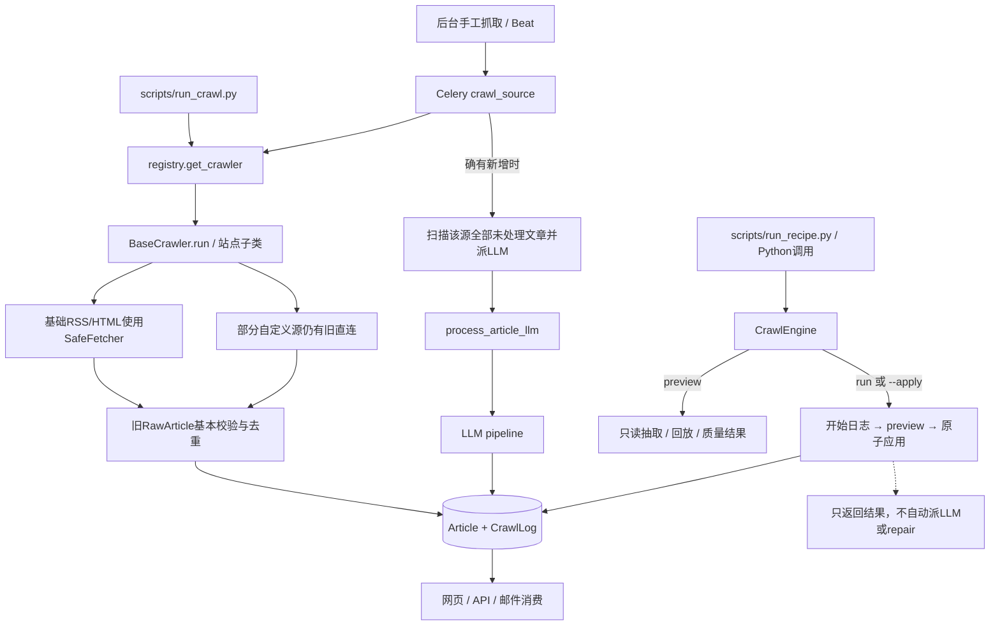
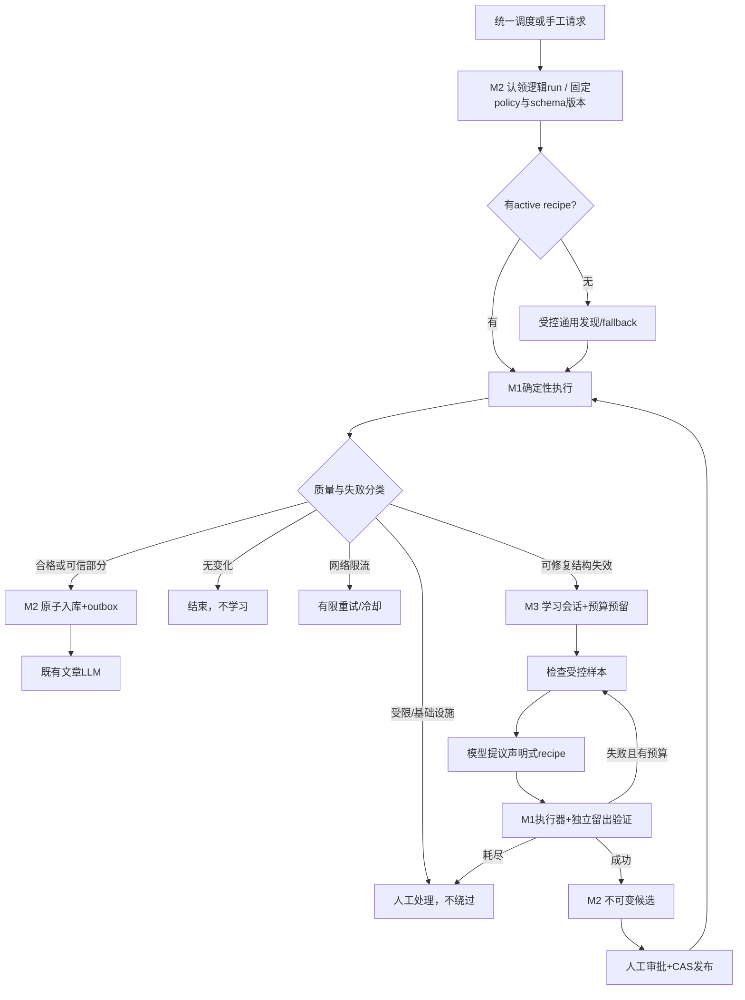

# 动态爬虫：当前架构与代码导览

基于本地 `4477cfd` 静态核对；M1发布应用为 `1052edf`，生产schema为 `e6a91f4c820d`。本文不改业务代码、不启动采集。[发布证据](../audits/2026-09-07-m1-release.md)与[后续计划](../superpowers/plans/2026-09-06-dynamic-crawler-agent.md)另见链接。

后续记录：2026-09-08已本地实现[M2-A候选保存](../audits/2026-09-08-m2a-candidate-http.md)与[B1后台受控预览](../audits/2026-09-08-m2b1-admin-preview.md)，随后[B2a私有证据/回放](../audits/2026-09-08-m2b2a-private-evidence.md)也本地完成；均未部署，持久policy/独立验证/审批/active路由仍未完成。上述A/B1/B2a已于2026-09-09随90c94b6合入master，CI离线574/14、MySQL14/14成功；[合入记录](../superpowers/plans/2026-09-08-m2-mainline-integration.md)。下文仍是4477cfd时点的架构快照，不把后续实现倒写为M1已有能力。

## 1. 先分清“现在有什么”

核心设计：**确定性程序负责抓取和验收，Agent以后负责提议/修复recipe，不负责每篇新闻重新推理抓取方式。**

| 层 | 当前实现 | 尚未实现 |
|---|---|---|
| 现有新闻生产链 | Admin/Beat → Celery → Python registry → 旧Crawler → Article → LLM | 尚未自动切到新CrawlEngine |
| M1确定性底座 | recipe校验、SafeFetch、解析监督、质量门禁、preview/run、入库保护、CLI | 尚无active recipe数据库路由 |
| M2配置与运行控制 | Article已提前增加三个质量字段 | profile/schema版本、审批/CAS、lease/fencing、outbox、统一调度 |
| M3学习 | 可复用已存在的LLM路由与费用日志 | 学习循环、持久化轮次、硬预算预留、留出验证、学习队列 |
| M4浏览器 | 新SafeFetch明确拒绝browser请求 | 隔离Playwright、子请求控制、代表源渐进迁移 |

不是“Agent写完了但没打开开关”：学习状态机、版本发布、浏览器等确实尚未实施。`startup_discovery.py`是旧公司目录发现流程，也不是新闻recipe修复Agent。

## 2. 当前两条真实入口



虚线连接的是说明，不是任务派发：CLI/run本身不派LLM。入库文章可能以后被旧源任务或管理员的未处理文章扫描选中，不代表永久不会付费处理。

### 2.1 旧生产入口的代码顺序

1. [Admin source_crawl_now](../../app/web/views/admin.py#L110)调用`crawl_source.delay(source.id)`。
2. [Celery配置](../../celery_app.py#L23)注册任务并路由到`crawl`队列。
3. [crawl_source](../../app/crawlers/tasks.py#L17)检查source存在/启用，调用`get_crawler(source).run()`。
4. [registry.get_crawler](../../app/crawlers/registry.py#L23)的优先级是：slug注册类 → DB的`crawler_class`导入路径 → RSS/Atom默认基类；未注册HTML直接报错，不是自动生成recipe。
5. [BaseCrawler.run](../../app/crawlers/base.py#L126)：独立开始日志 → `fetch_articles()` → 同轮/DB身份去重 → 基本校验/savepoint入库 → 更新时间 → 独立完成日志。
6. 新增数大于0才进入[_enqueue_llm_processing](../../app/crawlers/tasks.py#L156)，其实际扫描的是**该源所有`llm_processed=False`文章**，不是只派本轮返回的IDs。文章提交与发消息仍不是同一事务。

[企业官网摘录](../../app/utils/website_fetcher.py#L21)也已接SafeFetcher，但不是新CrawlEngine，其HTML解析仍在调用进程。`startup_discovery.py`与15个仍有直接HTTP的旧source模块未全迁移，不能一概套用新出口保证。

旧`RawArticle/CrawlResult`与新`NormalizedArticle/CrawlOutcome`是两套类型，尚未统一。旧基类只做基本有效性，不等同M1完整质量门禁；旧基类解析仍在worker进程里执行。旧日志/业务提交顺序也不同于新引擎原子终态事务。

### 2.2 调度与部署拓扑

[实际Compose](../../docker-compose.yml)：

```text
Caddy → web（Flask/Gunicorn）
         ├─ MySQL：来源、文章、爬取日志、LLM配置/费用等
         └─ Redis：消息、缓存与现有调度门禁等

beat          发定时任务，不执行抓取
worker_fast   消费 crawl,email，并发2
worker        消费 llm，并发4
```

生产叠加prod/caddy配置，只更新四应用，web仅映射127.0.0.1:8800，无源码挂载。Redis当前混合承担消息/缓存等职责，不能据此认为已有可靠、不可驱逐的lease/预算控制存储。新HTTP/parser helper是按需子进程，**不是新增的常驻Docker服务**。

以代码而非旧概述为准：Beat每600秒调用频率检查；任务内部还有Redis控制的全局检查间隔，默认6小时。daily-crawl固定Paris 01:00触发，再核对DB配置的小时/时区；这不是已有统一`next_due_at`调度。M2要消除这些规则之间的偏差。

## 3. M1模块如何组合

```text
scripts/run_recipe.py
    ├─ schema.validate_recipe() → ValidatedRecipe
    ├─ FetchPolicy             → 系统提供网络权限/配额
    ├─ QualityProfile          → 系统提供正文门槛/可选基线
    └─ CrawlEngine
         ├─ preview()
         │    ├─ fetcher.SafeFetcher → _fetch_worker.py
         │    ├─ _parser.parse      → _parse_worker.py
         │    │                         ├─ _extraction.list_records
         │    │                         ├─ _extraction.detail_fields
         │    │                         └─ quality清洗/字段读取
         │    ├─ quality比较/级别/日期/基线
         │    └─ contracts → NormalizedArticle / QualityReport
         └─ run()
              └─ _ingestion.run → preview + Article/CrawlLog事务
```

[Interface定义](../../app/crawlers/engine.py#L51)：

```python
engine = CrawlEngine(
    source_id,
    recipe=recipe_dict,
    fetch_policy=FetchPolicy(allowed_hosts=(approved_host,)),
    profile=QualityProfile(),
)
preview = engine.preview()   # 不读写业务DB；无LLM
# 在已迁移DB的应用上下文中显式选择：
# outcome = engine.run()     # 重新执行preview后应用，不是提交上面的preview对象
```

`preview/run`是统一的外部Seam，复杂HTTP、解析和持久化Implementation在内部，不要求调用者逐个调用helper。当前只有CLI/Python接到这个Interface，Admin/Beat还没有接入。

### 受限Legacy Adapter不是旧代码沙箱

构造器也可接收`legacy=`，经[_legacy.recipe_for](../../app/crawlers/_legacy.py#L6)把确切RSSCrawler/HTMLCrawler基础配置转成recipe，再走同样校验与执行。它**不调用旧fetch/run，不接受自定义子类**，也没有被registry自动调用。原设计的泛化适配范围在M1实现时已收紧，防止旧Python直连绕过新保证。

## 4. recipe、policy、profile、contract不能混为一谈

| 对象 | 回答的问题 | 代码 |
|---|---|---|
| `ValidatedRecipe` | 在哪页、哪个节点读取哪个字段？ | [schema.py](../../app/crawlers/schema.py#L35) |
| `FetchPolicy` | 允许哪些主机、多久、多少次、多少字节？ | [_fetch_policy.py](../../app/crawlers/_fetch_policy.py#L79) |
| `QualityProfile` | 什么样正文合格？是否提供历史参考？ | [quality.py](../../app/crawlers/quality.py#L104) |
| `NormalizedArticle`等 | 结果必须满足什么类型与内部一致性？ | [contracts.py](../../app/crawlers/contracts.py#L92) |

已有[完整HTML样例](../examples/news-recipe.json)，其域名是占位符。核心字段是：

```text
source_id / locale / identity_policy
list_pages：URL、item_selector、字段读取、有限下一页
detail_templates：host/path匹配、正文/标题/日期等字段、去噪selector
或 feed：URL与固定RSS字段映射
```

- 顶层`extractor`当前仅`html/rss`；**JSON-LD是详情字段的`read: jsonld`，不是第三个顶层模式**。
- 只允许固定字段读取、受限CSS、固定JSON-LD路径；没有任意Python/JS、eval、正则代码或任意浏览器动作。
- schema最多64KiB/12层/2048值，限制列表/模板/字段/selector数量；拒绝未知字段、重复JSON key、NaN等。
- 规范JSON生成SHA256指纹，同一配置可识别。指纹不是审批记录，也不是配置版本数据库。
- recipe不能自带active权限、提高网络配额或降低质量门槛。`validate_recipe()`通过仅说明结构允许，**不等于可以联网或发布**。
- `locale`是已声明语言，不是语言识别模型的检测结果；未知保持unknown。

## 5. 网络与解析为什么分开

### 5.1 SafeFetch：允许请求什么、如何请求

[fetcher.py](../../app/crawlers/fetcher.py#L37)负责父进程监督；[_fetch_worker.py](../../app/crawlers/_fetch_worker.py)负责真正HTTP。文件中的`Engine`只是HTTP内部实现，不要与`CrawlEngine`混淆。

```text
URL语法/精确主机许可
 → robots规则与逐跳权限
 → 每次DNS结果全部检查为public IP
 → 连接批准的数值IP、核对peer
 → 保留原Host/SNI/证书主机校验
 → 状态/MIME/协议/压缩解压限额
 → FetchResponse(body, document_url, observation)
```

- 拒绝私网/loopback/特殊IP、userinfo、非标准端口、HTTPS降级、未许可跨域。
- 不使用环境代理/netrc、持久cookie、SDK隐藏重试；每次跳转重新校验。不是先验域名、再让客户端任意解析连接。
- robots/Crawl-delay/Retry-After受控；429/5xx等保留固定错误与重试提示，不通过换UA/浏览器绕过。
- 默认一次实例60秒、16请求、单响应2MiB、累计8MiB；robots、跳转共用配额。协议/framing、压缩和解压数据分别受限，不等于全线路计费或总RSS上限。
- 父进程非阻塞IPC监督，子进程POSIX SIGALRM共享绝对截止；一次SafeFetcher复用一个HTTP子进程，退出with回收，不跨worker共享实例。
- 观测URL去query/fragment，原body与准确document_url隐藏repr；不要把整个对象打印或交给模型。

### 5.2 Parser：不应让网页长期占住worker

[_parser.parse](../../app/crawlers/_parser.py#L11)每个文档启动[_parse_worker.py](../../app/crawlers/_parse_worker.py)，传入有限字节与已校验规则。后者只调用[_extraction.py](../../app/crawlers/_extraction.py)，不导入业务应用/DB，封闭Python网络方法。

默认单parse3秒，并受preview总截止约束；单文档512KiB，DOM20,000节点/64层，JSON-LD4096节点/32层，输出2MiB。超时kill/reap；缺依赖/启动失败为`parser_unavailable`，不回退无限期主进程解析。

**两个helper只清理环境/文件描述符并监督进程，不是文件系统、容器或完整网络安全沙箱。** 只有新CrawlEngine走这个解析监督；旧基础Crawler虽然使用SafeFetcher，feedparser/BeautifulSoup仍在原worker内运行。

## 6. preview的实际执行逻辑

[engine.py:91](../../app/crawlers/engine.py#L91)可概括如下（说明性伪代码，不是额外Interface）：

```python
固定本次recipe、policy、profile、deadline
for 列表或feed:
    for 允许的页数:
        读取本页：SafeFetcher，或明确的只读snapshot回放
        受监督解析候选记录
        for 候选（全preview最多处理200条）:
            检查title/url
            相对URL按本页真实document_url解析
            保留legacy原始URL身份，另做canonical权限/本轮去重
            选择host/path最长匹配详情模板
            # 合格的RSS全文可跳过详情；模板同等冲突则拒绝该详情选择
            若需详情：抓取、清洗、核对列表标题/正文相关性
            确定content_level；解析有证据的UTC日期
            构造NormalizedArticle + 字段来源
合并错误类别、检查质量比例/可选历史基线
返回CrawlPreview，而非业务入库ID
```

### 格式差异

- HTML：有限selector读取列表和详情，有限next-link；不用页面`base`/远程canonical扩大权限或改文章身份。
- RSS/Atom：保留GUID；summary最多excerpt，明确feed content通过质量检查才有资格full。
- JSON-LD：只选固定类型、唯一匹配的同一文章实体；只读约定字段，拒绝歧义/重复key。description最多excerpt，不能因为很长就冒全文。
- 详情标题/正文不符、访问受限或缺字段时，不采用不可信详情；若列表元数据本身合格，可以保留为部分结果，并报告错误。

### 质量判断

[quality.py](../../app/crawlers/quality.py)：清除脚本、导航、表单、显式隐藏节点和指定推荐/广告区；检测有限登录/付费/challenge特征。检查标题重合、正文词面相关性、重复段落、链接密度。

默认news正文≥200字符/2段；CLI bulletin为≥80字符/1段。不是只检查字数，也不是事实真实性、版权、完整性或语言真实性认证。

日期有时区转UTC；无时区仅在配置了IANA时区且能唯一确定时接受，DST歧义/不存在本地时间保持unknown，不填现在。

当前比例检查实际使用`valid/extracted`（函数调用传入已处理量）；历史参考由可信调用者提供，尚无自动DB基线采集。

| 状态 | 典型含义 |
|---|---|
| `ready` | preview有可用条目，无记录错误，不代表已入库 |
| `success` | run确有新增/升级且无错误；ready在全部重复时改为no_change |
| `partial` | 有可信部分，也有其他错误 |
| `degraded` | 有可信条目，错误仅为low_quality |
| `no_change` | 确认空RSS；run中也可为全部重复 |
| `inconclusive` | 缺证据，例如未知空HTML/无可复用正文的304 |
| `blocked` | 无可信文章且出现权限/访问限制 |
| `failed` | 无可信结果的其他失败，或持久化失败 |

没有“HTTP200=正文成功”，也没有“新增0=触发修复”。M1所有实际run的`repair_dispatched`仍为False。

## 7. run的事务、去重与证据

[engine.run](../../app/crawlers/engine.py#L85)调用[_ingestion.run](../../app/crawlers/_ingestion.py#L15)：

```text
短读：source存在/启用，保存URL/feed/updated_at输入
    ↓
事务A：创建running CrawlLog并提交（网络开始前）
    ↓
preview：抓取/解析/门禁；不持有业务写事务
    ↓
事务B：SELECT source FOR UPDATE，复查source仍启用且输入未变
    ├─ 按source+external_id查旧文章，再按source+URL兼容历史
    ├─ 只插入或升级较低质量内容
    ├─ 更新source时间与字段证据
    ├─ 构造CrawlOutcome、验证计数/IDs/状态
    └─ Article与完成日志一起提交

失败：事务B回滚；另外尝试标失败日志
```

关键约束：

- 首次日志都不能创建时抛异常，不伪造run_id；进程崩溃/失败日志再次写失败仍可能留running，M2需要恢复机制。
- RSS GUID优先；默认hash来自规范化前的legacy解析URL，canonical用于权限/存储/同轮去重，不悄悄换历史身份。
- 等级`metadata_only < excerpt < full`。同等级/更好的内容不覆盖；旧NULL但已有正文保守当作需保护内容，而不是低质量记录。
- 升级清正文相关LLM派生结果并标待处理，同标题保留翻译；人工关系/情感保留，缺失旧author/image/date不清空，保留值的证据明确legacy。
- 每次run独立事务/日志；不是持久化逻辑run重投递，不是lease/fencing。source行锁只覆盖最后应用，不能阻止并发重复抓取。
- 不提交/回滚调用者Session；MySQL REPEATABLE READ下，调用者需要新观察事务才能看到新提交。此前CI的旧快照错误即来自这里。

### 当前持久化与返回值

| 对象 | 当前去向 |
|---|---|
| `NormalizedArticle` | 新引擎在内存生成，经run写入Article |
| `FieldProvenance` | Article JSON中记录字段method/snapshot哈希/locator |
| `FetchObservation` | 返回抓取元信息；不是全量HTTP请求账本 |
| `QualityReport` | 完整报告在返回值/CLI；旧CrawlLog只保存部分计数 |
| `CrawlOutcome` | 真实run_id、状态、IDs、质量、错误、retryable等返回；预留schema_version_id/quality_report_id当前为None |
| `CrawlLog` | 仍只有running/success/failed三值，partial/degraded可映射为failed，即使好部分已提交 |

[Article三列](../../app/models/article.py#L39)：`content_level`、`source_language`、`crawl_provenance`。后者含recipe指纹、engine版本、质量profile、字段来源、content hash。原始字段仍叫title_fr/content_fr，兼容旧数据库；实际语言用新字段解释。

原始snapshot不自动进入DB；CLI显式`--save-snapshots`新建0600文件，可`--replay`只读复验。缺页不联网，回放不能`--apply`，hash无法认证真实来源或找回已丢失网页；这不是M2快照生命周期。

CLI退出1的partial/degraded**可能已写入好部分**。候选真正的只读测试应使用preview，不以退出码推断零写入。

## 8. 文章LLM与未来修复LLM是两条逻辑

### 当前文章分析

[process_article_llm](../../app/llm/tasks.py#L14) → [pipeline.process_article](../../app/llm/pipeline.py#L15)：

```text
短事务读取文章/级别/语言/版本
 → 无业务写锁地收集模型结果
 → 最后事务锁文章、核对输入未变/未被其他消费者应用
 → 原子保存文本、分类、公司关系等
```

收集顺序：标题翻译 → 有资格的正文digest → 多语摘要 → 公司NER → 每公司情感 → 分类/highlights → 有资格的文章insight。

- 标记metadata_only/excerpt不生成文章digest/insight；仍可做标题翻译、浅层summary/NER/情感/分类，**不是完全不调用LLM**。
- 旧NULL且有正文保留旧兼容行为；源文本prompt不再无条件称法语。
- 文章应用后包装任务还可能best-effort刷新已有公司分析；这也不是recipe学习Agent或可靠outbox。
- 新CLI本身不派任务；旧爬虫任务/Admin/LLM CLI仍可启动文章分析。

[LLMClient](../../app/llm/client.py)：DB任务分配→主备/priority/成本排序，Redis缓存、结构化校验、供应商断路器、每个逻辑请求最多3次配置尝试；费用单独Session记账，不随Article回滚消失，记账失败不再fallback付费。

[实际路由顺序](../../app/llm/routing.py#L5)并非无条件最低价：先assigned后default，各组primary→fallback→priority→成本→ID。总预算当前是用量检查，不是并发硬预留；最终锁只防重复应用，不防并发重复付费。

## 9. 未来怎样闭合成动态Agent

以下是**目标流程，不是当前可执行调用图**：



M3只给`inspect_snapshot / fetch_allowed_page / test_recipe / submit_candidate`一类受限工具；没有任意exec、改质量标准、扩大网络许可、直接写Article或activate权限。已批准3轮/US$0.20每会话/US$1每日的方向，但对应硬预留与持久化计数还未实现。

M2新增版本/profile、审批/CAS、lease/fencing、outbox、next_due调度，才把“手工可运行”接到“日常可追溯运行”。完整逻辑run身份与重试恢复也在这里，而不是简单把`get_crawler()`替换为`CrawlEngine()`。

M4新增隔离浏览器，子请求也受控，不持业务凭据/宿主挂载/Docker socket，不绕登录/付费墙/验证码。现有HTTP/parser helper不能替代浏览器沙箱。

## 10. 按什么顺序看代码

1. [scripts/run_recipe.py](../../scripts/run_recipe.py)：看新入口、preview/apply/replay的区别。
2. [engine.py](../../app/crawlers/engine.py)：看业务编排与状态。
3. [schema.py](../../app/crawlers/schema.py) / [contracts.py](../../app/crawlers/contracts.py)：看输入与输出约束。
4. [fetcher.py](../../app/crawlers/fetcher.py) / [_fetch_worker.py](../../app/crawlers/_fetch_worker.py)：看网络许可与进程监督。
5. [_parser.py](../../app/crawlers/_parser.py) / [_extraction.py](../../app/crawlers/_extraction.py) / [quality.py](../../app/crawlers/quality.py)：看解析及正文判定。
6. [_ingestion.py](../../app/crawlers/_ingestion.py)：看事务、身份兼容与质量升级。
7. [pipeline.py](../../app/llm/pipeline.py)：看质量信息怎样保护下游。
8. [tasks.py](../../app/crawlers/tasks.py) / [registry.py](../../app/crawlers/registry.py)：对照仍需迁移的旧自动入口。
9. [test_engine.py](../../tests/test_crawlers/test_engine.py) / [test_safe_fetch.py](../../tests/test_crawlers/test_safe_fetch.py) / [MySQL用例](../../tests/integration/test_mysql_m0.py)：看真实承诺的行为。

**一句话定位：现在已上线的是“安全抓取与确定性验收底座”；下一步M2把它接进版本化的生产调度，M3再让Agent学习规则，M4补受控浏览器。**
