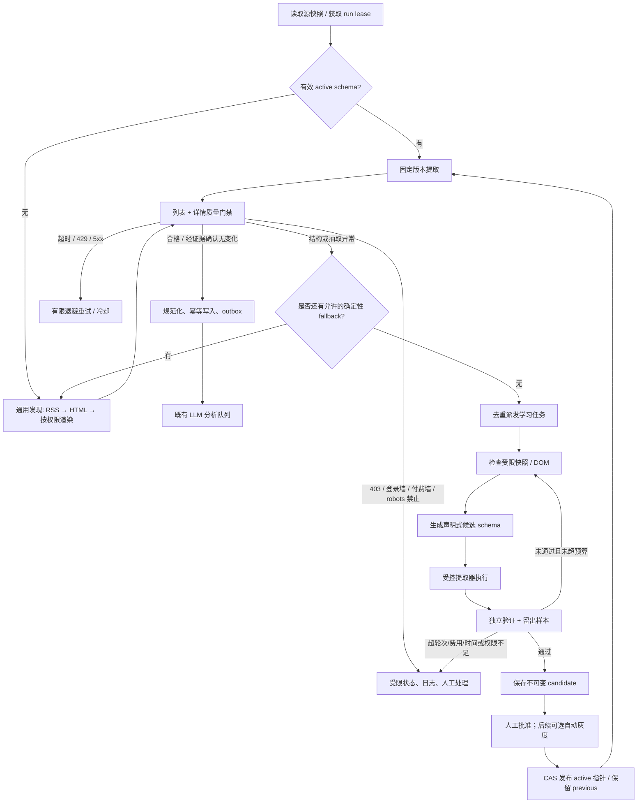

# 动态爬虫 Agent 改造设计

- 日期：2026-09-06
- 基线：`bf9cc61b94556e00218af267db82bf42a3b80eef`
- 输入：用户提供的“读取源 → 常规框架/已有 schema → 质量检查 → Agent 学习 → 固化/人工复核”流程图。
- 状态：**用户已批准默认方向并开始 M0 基础修复；Agent 尚未实施/上线。** 首版仅新闻、人工发布、允许元数据但仅标题不生成洞察、隔离公开页面渲染；3 轮/US$0.20 每次/US$1 每日已批准。其余数值为可配置初值，不是实测指标，生产资源仍需测量。
- 关联：[全项目审查](../../audits/2026-09-06-project-audit.md)、[分阶段实施](../plans/2026-09-06-dynamic-crawler-agent.md)。

## 1. 核心判断

采用 **确定性采集主流程 + 有界 Agent 配置修复流程**。

Agent 负责发现和修复“如何抽取”，不负责每次在线抓取都重新推理，不直接写业务表，也不运行自己生成的 Python/JS。学习结果是可验证、可版本化、可回放的声明式提取配置。

不建议第一版引入多 Agent 自由协作、向量记忆库、大型编排框架或代码生成执行沙箱。现有 Celery、MySQL、LiteLLM 加一个持久化状态机已经足够。这里的 Agent 是项目功能，与本轮审查所禁用的子代理工具无关。

## 2. 对原图的补充

原图方向正确，但需要明确以下语义：

1. **已有 schema 与通用发现是优先级路由，不是每次同时抓两遍。** 已发布版本先走 fast path；无可用版本或可修复的结构失效才探测 RSS→HTML→渲染。
2. **HTTP 失败不都等于 schema 坏了。** 429/超时/5xx 退避，403/登录/验证码/付费墙进受限状态；不让 Agent 反复换选择器“修网络”。
3. **质量分为列表发现和详情正文两层。** 链接数量多不等于有效文章多，正文长也不等于抽到了正确正文。
4. **“发现 20 条，新增 0 条”通常正常。** 验证提取结果与历史基线，不以 articles_new=0 触发修复。
5. **schema 先候选、独立验证，再发布。** 不能同一个 Agent 说自己成功就覆盖生产配置。
6. **单源可能有多种页面模板。** 新闻/活动/公告、法语/英语、列表/详情分别建匹配规则，不用一个 domain 对应一个 CSS selector。
7. **去重与 LLM 的位置调整。** URL 规范化/候选去重尽量前置；详情质量合格后持久化并可靠派发 LLM；不要先花钱“整理评分”再去重。
8. **学习成功要能处理本轮数据。** 发布后使用保留快照重新提取/复验并提交本轮合格条目；无需等下一次定时爬取。待人工批准的候选仅隔离保存，不直接进入生产 LLM。

## 3. 目标流程



图中回到通用发现并非无限循环：每个 strategy 在同一 run 最多进入一次，所有 HTTP、浏览器与 Agent 调用共享剩余预算。重试记录持久化，Celery retry/进程重启不重置它。

## 4. 模块划分与 Interface

这里的 Module 隐藏内部复杂度，调用方不应知道 CSS 细节或 Agent 循环步骤。

### 外部 Interface（概念形状）

```python
# CLI / Admin / Celery 通过相同应用用例入口，不重复实现流程。
crawl_source(source_id, run_id) -> CrawlOutcome
repair_source(repair_session_id) -> RepairOutcome
promote_schema(candidate_id, expected_active_version, actor) -> PromotionOutcome
```

- `run_id` 是持久化逻辑运行身份；worker 重投递继续原 run，不创建无限新 run。
- `CrawlOutcome` 包含状态、新建/升级的 article_ids、schema_version_id、quality_report_id、结构化错误和是否已派发 repair。
- `repair_source` 只产生候选/验证证据，无任意业务写入和激活权限。
- `promote_schema` 要检查授权、证据、输入版本未过期；并发更改冲突时拒绝，不能“最后写 wins”。

### 内部实现与真实 Seam

| Module | 核心责任 | 可替换 Adapter |
|---|---|---|
| Crawl Engine | 状态迁移、主策略/fallback、质量、结果交付 | 旧注册爬虫 Adapter / 新 schema 引擎 |
| Safe Fetch | URL 权限、HTTP、限速、限额、重定向、快照 | requests Session / 隔离 Playwright / fixture replay |
| Deterministic Extractor | RSS、CSS、JSON-LD、受限浏览器动作提取 | RSS / HTML / rendered DOM，同一字段输出契约 |
| Quality Gate | 硬约束、软指标、历史基线、失败归因 | 规则验证器；人工 golden 样本为基准 |
| Repair Agent | 检查结构、提议配置、根据反馈修订 | LiteLLM 结构化模型；离线 scripted fake |
| Schema Registry | 不可变版本、校验、发布/CAS、撤销/回滚 | MySQL 存储；测试内存 Adapter |
| Article Ingestion | 身份兼容、去重/upsert、元数据升级、outbox | MySQL；隔离测试数据库 |

这些是代码模块，不要求每个都部署为独立服务。只有浏览器需要强进程/网络隔离。避免给每个函数都套一层 pass-through class。

### 建议代码位置

```text
app/crawlers/
  engine.py                # 统一采集编排；返回 CrawlOutcome
  contracts.py             # Fetch/Extract/Quality/Outcome 数据契约
  fetcher.py               # 所有非浏览器 HTTP 出口
  quality.py               # 规则与失败归因，无模型自我打分依赖
  identity.py              # canonical URL、legacy GUID/hash 兼容
  schema.py                # 声明式配置类型校验及静态安全检查
  schema_store.py          # 版本读写、发布和回滚
  extractors/              # rss/html/jsonld/rendered，按真实差异拆分
  agent.py                 # 持久化 repair loop，使用受限工具集合
  tasks.py                 # 轻量 Celery 适配
  sources/                 # 过渡期保留旧注册爬虫
app/models/crawl_schema.py
app/models/crawl_repair.py
app/models/outbox.py
app/llm/                   # 复用路由/预算/用量，先修复已发现的问题
```

文件是建议位置，实施时可合并过小模块。不要把过渡 legacy Adapter 层一直保留为新功能必须改两处的负担。

## 5. Schema 是什么

本设计中有两个不同概念：

- **输出契约**：NormalizedArticle 的字段/类型/来源要求，是系统控制的协议。
- **提取 schema（recipe）**：一个源/页面模板的抓取与抽取配置，可以由 Agent 提议，但不允许降低输出契约或安全策略。

### 示例 recipe（说明性示例，不是可直接导入的实现）

```json
{
  "format_version": 1,
  "output_contract": "article.v1",
  "target_kind": "news",
  "source_id": 42,
  "locale": "fr",
  "transport": "http",
  "list_pages": [
    {
      "url": "https://news.example.invalid/actualites/",
      "item_selector": "article.news-card",
      "fields": {
        "title": {"selector": "h2 a", "read": "text"},
        "url": {"selector": "h2 a", "read": "attr", "attr": "href"},
        "published_at": {"selector": "time", "read": "attr", "attr": "datetime"}
      },
      "pagination": {"kind": "next_link", "selector": "a[rel=next]", "max_pages": 2}
    }
  ],
  "detail_templates": [
    {
      "match": {"host": "news.example.invalid", "path_prefix": "/actualite/"},
      "fields": {
        "title": {"selector": "h1", "read": "text"},
        "content": {"selector": "article .article-body", "read": "paragraphs"},
        "published_at": {"selector": "time", "read": "attr", "attr": "datetime"}
      },
      "remove_selectors": [".share", ".related", ".advertisement"]
    }
  ],
  "date_policy": {"source_timezone": "Europe/Paris"},
  "identity_policy": "legacy-compatible-url-v1"
}
```

- RSS recipe 保存 feed URL、GUID/链接映射、是否需要详情补全；不能把列表摘要误标为 fulltext。
- JSON-LD 只接受约定类型（Article/NewsArticle/Event 等）和有限字段路径；不执行 JS。
- CSS 限制数量、长度、复杂度与解析时间；字段 read/transform 仅允许列表，不允许自定义表达式/任意 regex/eval/import。
- browser recipe 只允许 `goto`、有限 `wait_for_selector`、受限滚动、预批准的“更多/下一页”动作；禁止任意 evaluate、表单提交、登录、文件访问、下载或修改网站状态。
- **安全域名、预算、质量阈值在 source policy 中，由系统/管理员控制。** Agent 不能通过候选 recipe 扩权、提高预算、降低合格线。
- 内部版本 ID、创建人、模型信息、证据 ID、active 状态由服务器生成，不接受模型指定。

## 6. 质量门禁：不能只看条数

### 三层判断

| 层次 | 判断 | 不合格处理 |
|---|---|---|
| 传输 | 状态码、content-type、字节上限、跳转、验证码/登录/错误页特征 | 网络退避或 blocked，不默认学习 |
| 抽取 | 候选链接有效率、模板匹配、标题/正文/日期解析、空字段、列表/详情一致性 | 指出失败字段和样本，必要时 repair |
| 业务 | 是否文章而非导航/目录、正文是否只含推荐/页脚、语言、重复/旧页面、来源证据 | 隔离条目、metadata_only 或 degraded |

硬约束先行，软分只作辅助排序：URL 在授权范围，title 非空且长度可入库；content 清洗后满足目标 profile；正文/标题在原始证据中可定位；内容安全处理完成。LLM 自报 confidence 不能覆盖硬失败。

### 建议质量指标

- discovered / extracted / valid / duplicate / new / updated / rejected 分开统计。
- 列表和详情请求成功率、必需字段完整率、正文字符/段落数、去模板噪声比例、列表标题与详情标题一致性。
- 日期可为空但记录 `unknown`；活动允许未来 event_date，不能一刀切认作错误；发布时间异常不能用“现在”静默填充。
- `content_level = full | excerpt | metadata_only`；低质量内容不伪装成完整文章做深度洞察。
- 历史使用最近成功 run 的“有效抽取量/内容完整度”稳健基线，不看新增量、不用一个固定 min_articles=5 覆盖所有源。
- 304、有已确认稳定模板且条目全重复、低频站点无更新，应 `no_change`；首次零条且无证据则 `inconclusive`，不是成功也不直接无限 repair。
- 若一页坏、一页正常，持久化已通过门禁的部分，run=`partial`，只修坏 profile；未通过候选 recipe 的数据仍隔离。

建议全文章 profile 初值：正文不少于 200 个清洗字符并包含有效段落，列表有效链接率约 90%，详情必需字段成功率约 90%。这些只是启动假设，要按 RSS 短讯/研究所/活动样本校准，不作为通用真理。

### 学习后的独立验证

- learning samples 与 holdout samples 分离。正常情况下至少覆盖 1 个列表和 3 个不同详情，覆盖目标模板；不足时转人工，不伪造验证样本。
- 留出页由执行器选择，不由 Agent 挑最好过的一页；尽可能包含旧成功样本和新抓样本，防止仅拟合坏页面。
- 旧 known-good recipe 的结果用于比较，但不能当唯一真值；人工标注/golden fixture、字段来源定位才是可靠依据。
- 验证器检查 schema 输出与实际快照一致；Agent 不参与修改期望值、阈值或验收程序。
- 质量合格不保证新闻事实真实；LLM 摘要/洞察质量是独立下游问题，需要源链接和证据标记。

## 7. Agent 学习流程与权限

### 持久化状态

```text
queued → inspecting → proposing → extracting → validating
                                   ↑              │
                                   └─ feedback ───┘
validating → candidate_ready → awaiting_review → approved
           → exhausted / blocked / cancelled / superseded
```

触发条件：无 recipe 且通用抽取不满足 profile；已有 recipe 出现结构性漂移；管理员显式发起学习。超时、429、纯新增量为零、被禁止访问本身不作为学习触发。

每轮：
1. 获取 source policy/active version 快照与失败证据。
2. 向模型提供裁剪、去脚本/敏感字段的 DOM 结构与字段缺失反馈。
3. 严格解析候选 recipe；安全校验不通过只给结构化拒绝原因。
4. 确定性执行器应用配置，返回提取结果与字段来源。
5. 独立验证器返回 `error_code + evidence + suggested_area`，不只返回“分数低”。
6. 成功保存 candidate；失败有预算才下一轮。相同 recipe hash/同类反馈重复出现则提前停止。

### 受限工具集合

- `inspect_snapshot(snapshot_id)`：读受控结构/摘录，不读数据库凭据、其他源内容。
- `fetch_allowed_page(url)`：过 Safe Fetch 及 source policy；不允许任意网络出口。
- `test_recipe(recipe, sample_ids)`：执行确定性提取；没有 exec 工具。
- `submit_candidate(recipe, evidence_ids)`：只能候选，不能 activate。

网页、RSS、模型输出都是不可信数据；页面里的“忽略规则”“请打开本机地址”等文本不能成为工具指令。提示词之外还要 schema 校验、工具白名单和网络隔离三重约束。日志默认不保留模型隐式思考内容，只留结构化决策、输入快照 hash、候选、反馈和用量。

### 建议初始预算（待用户确认）

| 参数 | 建议初值 |
|---|---:|
| 每次学习最大轮次 | 3 |
| 逻辑会话总时限 | 180 秒 |
| 每源并行学习 | 1 |
| 全局并行学习 | 1 起步，观测后再增 |
| 每会话顶层页面导航/HTTP 页面请求 | 10（包括重试/验证） |
| 浏览器会话资源请求 | 200 上限，图片/视频/字体默认阻断 |
| 总下载量 | 20 MiB/学习会话，单响应更小上限 |
| 每会话总 token | 20,000 输入+输出合计，包含 fallback |
| 每次学习费用 | US$0.20 上限 |
| 全局 Agent 每日预算 | US$1.00，且同时受现有总 LLM 预算限制 |
| 失败后再学习冷却 | 6 小时；管理员受控重试也计费、留审计 |

预算按系统定价和输出上限**预留**，不能简单调用后 sum(cost)。超时/费用未知不能立即释放全部预留并继续调用。网络预算包括 robots/跳转/重试/浏览器子请求，不能只数工具轮次。网页超大、触发恶意循环、token 耗尽都要落终态并告警。

## 8. Schema 生命周期与发布

建议状态：`candidate → validated → active → superseded/retired`，拒绝为 `rejected`。验证状态与发布权限分开。

V1 默认人工批准。即使通用 RSS 自动发现成功，也先正常采集合格结果并保存候选；未经批准不永久改 active 指针。未来可配置“低风险 RSS 候选自动发布”，但需要明示策略。

发布事务检查：
- source 仍启用且 policy/source fingerprint 未变。
- candidate 的 base_version 仍等于 expected_active_version。
- 验证证据未过期，engine/output_contract 与运行时兼容。
- actor 有发布权限，新增域名/浏览器动作权限经过独立批准。

MySQL 事务内更新 `source_profile.active_schema_id` 并增加 generation，保留 previous；每次 run 固定自己的 schema_version，运行中不热替换 selector。对同一源并行 repair 采用唯一认领与 fencing token，过期 worker 不能覆盖新决策。

后续自动发布模式：先 shadow（不写业务库），跨至少两次独立验证运行比较质量，再小流量 canary；真实质量下降则回滚 active 指针并进入 cooldown。回滚代码配置不会自动撤回已写错误文章，因此 ingestion 必须保留 run/schema 来源，支持按批隔离和重新处理，而不是直接删历史数据。

## 9. 存储与可观测性

### 建议增量模型

| 表/字段 | 内容 |
|---|---|
| `crawl_source_profile` | NewsSource FK、target_kind、locale/页面族、source policy、active/previous schema、generation、next_due_at；V1 可先每源一个 profile |
| `crawl_schema_version` | profile FK、不可变 recipe JSON/hash、format/output/engine version、base_version、状态、创建来源、验证摘要、审批人/时刻 |
| 扩展 `crawl_log`（作为 run） | run_id、task_id/attempt、profile/schema FK、详细状态/错误码、lease/fencing、时间/计数/预算用量、质量报告 |
| `crawl_repair_session` | source/profile/run、active_version 快照、状态、轮次、request/token/cost/deadline 余额、cooldown、候选版本 |
| `crawl_repair_attempt` | 每轮候选 hash、反馈、样本/快照引用、验证结果、LLM usage 关联；不存隐式思考 |
| `outbox_event` | 唯一逻辑 event key、payload、派发状态、尝试/next_attempt；与 Article 或 repair 创建同事务 |
| Article 增量 | source_language、content_level、canonical_url_hash、raw/source identity、content_hash、last_seen_at、最近 run/schema 来源；必要时独立 observation 表保存完整历次来源 |

不在 MySQL 大字段中无界堆 HTML/截图。快照保存在受限卷/对象存储，DB 存 hash/引用，限制保留天数和容量；错误样本脱敏、按管理员权限访问。源 policy、模型 prompt、引擎版本变化都应使旧验证证据需重验。

V1 优先最小新增表和扩展既有 CrawlLog，暂不强行合并 NewsSource 与 StartupSource。schema recipe 以 target_kind 区分，后续接入公司目录时不会硬塞进 Article。

### 管理员界面

- 源状态：最后正常抓取/最后尝试、有效条目/完整正文率、active schema、漂移/受限原因、下一次抓取/冷却。
- 版本页：配置 diff、样本预览、质量对比、候选提交者、批准/拒绝/回滚按钮。
- 学习页：有限轮次时间线、结构化失败原因、预算消耗、查看脱敏快照、取消/受控重试。
- 不把“本轮无新增”渲染成错误；不把“只抓到标题”渲染成 full success。

监控：按 source/profile/transport 统计有效抽取率、正文率、数据新鲜度、HTTP 失败、schema fast-path 命中、repair 触发/成功/拒绝、人工复核积压、每源费用、outbox 延迟。报警聚合相同源/原因，避免每次 retry 发一封邮件。

## 10. Celery、资源和故障隔离

保留既有 `crawl / llm / email`；新增 `crawl_learn` 队列和低并发 worker。浏览器渲染使用独立 worker/受控进程池（可单独 `crawl_render` 队列），不是在每个爬虫任务里临时创建无限浏览器。

- `crawl`：主要 HTTP/确定性提取，不同步等待长时间 LLM。
- `crawl_learn`：修复状态机，使用模型预算和受限工具；有持久化检查点。
- 浏览器执行环境：无应用 DB/Redis/LLM 密钥、无宿主文件挂载、无 Docker socket、非 root、沙箱开启、资源限额、出站网络控制；只接收受控请求并返回快照。消费 Celery 的协调 worker 与实际浏览器隔离进程分开，broker 凭据不传入浏览器沙箱。
- `llm`：Article enrich 与 company analysis，增加步骤幂等和任务认领。
- `email`：不再与可长时间学习/浏览器任务争用同一进程池。

Celery 配置需同步 include、routes、worker `-Q`、timeout、prefetch 与健康检查。不要因加了队列名就假设有 worker 消费。重投递语义用幂等/outbox 实现；仅设置 `acks_late` 不能保证 exactly-once。

source 锁使用 token/到期/续租/比较删除，DB 状态更新携带 fencing generation，避免旧 worker 释放新锁。独立的“不驱逐控制存储”是前提。source 停用、候选过期或取消要在检查点生效；取消不意味着撤回已经发生的网络请求。

## 11. 接入当前代码的迁移方式

1. **修基础问题与测试。** 先解决审查中的 SEC/事务/迁移/幂等关键项，尤其 LLM 用量不能 commit 外层 Article。
2. **适配，不全量重写。** 旧 `fetch_articles()` 通过 legacy Adapter 返回统一结果；旧 registry 只处理 legacy，不让 Agent 写 `crawler_class` 或 import 路径。
3. **统一抓取出口和身份。** 将旧 requests/feedparser 直连逐步接入 Safe Fetch；未迁移的 legacy 源显式标记“不具备新安全保证”，不谎称已经全部安全。
4. **先做 schema 手工配置可运行。** 无 Agent 时也能 RSS/HTML/JSON-LD 抽取、质量检查、版本发布和回放。
5. **Agent 先生成候选。** 功能旗标按源启用：`legacy` / `schema` / `assisted`；独立 `repair_enabled` / `render_allowed` / `promotion_policy` 控制风险。
6. **按源对照验证。** 推荐 RSS（FrenchWeb）、简单 HTML（Schneider 或 La Tribune AURA）、复杂多页面（CEA-Leti）各一类。这里只按代码形态选样，未实测其当前网站结构和许可。
7. **保护已有身份与下游。** 新版本不替换旧 external_id；RSS GUID、历史 URL hash 建映射，以 canonical identity 辅助归并。metadata_only 更新成 full 时只触发相应内容版本的 LLM 重新处理。
8. **语言模型渐进迁移。** 当前英文内容会进 `title_fr/content_fr`。新增 source_language 与原始字段/适配读取，未知旧数据保留 unknown，不能全量断定旧内容是法语。prompt 改为按真实语言处理。
9. **清退重复逻辑。** CLI/Celery/Admin 走相同用例；验证稳定后删除被 recipe 完整替代的站点类，保留确有专有逻辑的 Adapter。

非目标：自动绕过登录/付费墙/验证码、任意网站无限探索、让模型自主生成并部署代码、第一版统一新闻与企业发现输出、替换现有所有 LLM/Web 功能。

## 12. 验收门槛

- 固定快照重复执行结果一致；active recipe 正常时不调用修复模型。
- 质量门禁位于文章业务入库/下游付费分析之前；修复阶段的 LLM 调用单独计费，不能与下游分析混淆；部分合格与无更新处理正确。
- 模拟 CSS 漂移可生成候选；跨学习/留出样本验证；不合格不发布。
- 重试/重投递/worker crash 不重置轮次/费用，不重复入库/派发。
- 超预算、超时、重复 recipe、无授权域名、内网跳转均有确定终态。
- 多任务同时修复同一源只产生一个有效 session；旧 worker 不能覆盖新 schema。
- schema 发布可回滚，失败候选不影响现有成功源；按运行版本追溯写入数据。
- SSRF、提示注入、巨型 HTML、畸形 selector、分页循环测试通过；浏览器禁用时功能正确降级。
- MySQL 迁移在空库/旧数据两条路径通过，恢复演练保留文章和 provider 配置。
- 运行效率目标暂不拍脑袋承诺：先采集各类源基线，再约定正文合格率、漂移修复率、p95 耗时与每源成本目标。

## 13. 已确认决策（用户已接受以下建议默认值）

1. **V1 范围**：仅新闻爬虫，还是把 StartupSource 的企业/研究所目录也一起改？建议仅新闻，目录第二阶段复用引擎但用独立实体契约。
2. **配置发布权限**：学习成功后人工批准，还是允许自动灰度？建议第一版人工批准，验证稳定后按源开放自动灰度。
3. **内容目标**：必须完整正文才入主流程，还是允许摘要/标题？建议元数据可以保存，但不对仅标题记录生成看似充分的深度洞察；页面明确内容级别。
4. **浏览器/访问范围**：是否允许隔离 Playwright？是否只访问公开无需登录内容？建议允许受限渲染，不自动处理登录、验证码、付费墙；403 默认人工处理。
5. **资源与预算**：目标部署主机可分给浏览器/学习多少内存？是否接受默认 3 轮、US$0.20/会话、US$1/日且包含在全局预算内？实际模型和定价按 DB/负责人配置。

用户已接受以上建议默认值并授权开始实施。先修复 P0/P1，再实现确定性基础和学习链路；生产资源实测、真实站点/付费调用验证和部署仍需单独确认。
